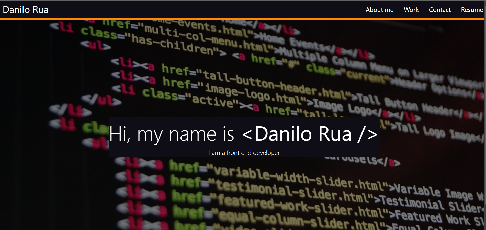

# Portfolio React

## Overview
This project is a portfolio website built using React. It showcases your work, skills, and contact information to potential employers or clients. The portfolio includes sections such as an About Me page, Projects page, Contact page, and possibly other sections depending on your preferences.

## Installation

1. Clone the repository to your local machine.
2. Navigate to the project directory.
3. Install dependencies:
-  npm install
-  npm i bootstrap @popperjs/core
-  npm install react-router-dom
-  npm install @fortawesome/fontawesome-svg-core

3. The portfolio website will open in your default web browser.

## Technologies Used
- React
- React Bootstrap
- React Router DOM
- Font Awesome

## Preview

You Can see a live demo [here](https://cheerful-paletas-6c58d9.netlify.app/)
## License
This project is licensed under the [MIT License](LICENSE).

## Contributing
Contributions are welcome! Feel free to fork the repository and submit pull requests.
